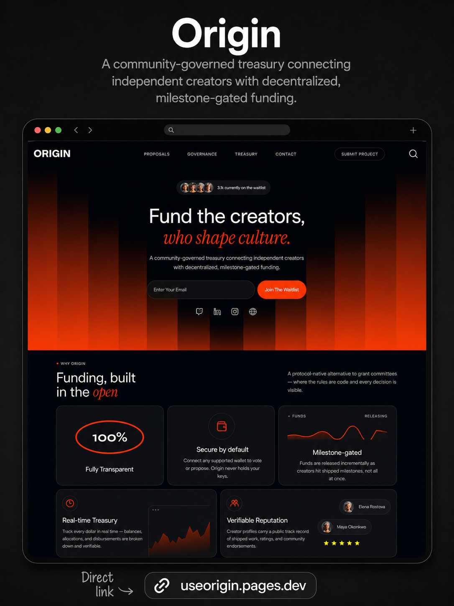
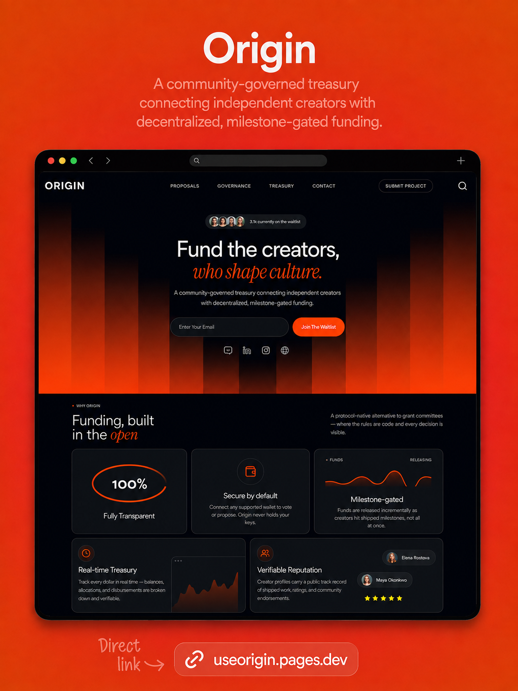

<div align="center">


# Origin

A community-governed treasury connecting independent creators with decentralized, milestone-gated funding.

Propose, vote, and fund projects transparently on-chain.
<hr>

<!-- Mockup screenshots -->
<div align="center" style="display: flex; justify-content: center; gap: 30px;">
  
  
</div>

</div>

---

## Project Structure

```
origin/
├── public/                    # Static assets served at root
│   ├── favicons/              # Favicon assets
│   ├── assets/                # Logos, mockups, avatars, graphics
│   │   ├── logo/              # Origin logo (PNG + OpenGraph WebP)
│   │   ├── favicons/          # Favicon files (ico, png, avif, webp)
│   │   ├── avatars/           # User avatar images (24 × 128px)
│   │   ├── gfx/               # Decorative graphics (AVIF/WebP)
│   │   └── mockup/            # README mockup screenshots
│   ├── robots.txt
│   ├── site.webmanifest
│   └── sitemap.xml
├── src/                       # Source code
│   ├── App.tsx                # App shell: lazy-loaded routing, nav, Lenis scroll
│   ├── main.tsx               # ReactDOM entry with BrowserRouter + ReactLenis + Helmet
│   ├── index.css              # Global CSS with Tailwind + custom theming
│   ├── vite-env.d.ts          # Vite client type references
│   ├── vite.config.ts         # Vite config (React + Tailwind, manualChunks)
│   ├── tsconfig.json          # TypeScript configuration
│   ├── package.json           # Project dependencies & scripts
│   ├── data/                  # Mock data for proposals, transactions, creators
│   │   └── mockData.ts
│   ├── lib/                   # Shared utilities
│   │   └── format.ts           # $N, $M, statusColor, statusTone helpers
│   ├── components/            # React UI components
│   │   ├── Landing.tsx        # Landing page composer
│   │   ├── Explore.tsx        # Explore proposals
│   │   ├── Governance.tsx     # Governance page
│   │   ├── Treasury.tsx       # Treasury page
│   │   ├── ProposalDetails.tsx# Proposal detail view
│   │   ├── ConnectWallet.tsx  # Wallet connection (MetaMask etc.)
│   │   ├── SubmitProject.tsx  # Project submission form
│   │   ├── Contact.tsx        # Contact form
│   │   ├── NotFound.tsx       # 404 page
│   │   ├── SEO.tsx            # Dynamic SEO metadata
│   │   ├── landing/           # Landing page sections (Hero, Features, Carousel, FAQ…)
│   │   ├── governance/        # Governance sub-components (Delegation, Overview, Rules…)
│   │   ├── treasury/          # Treasury sub-components (FundingCommitments, Activity…)
│   │   └── ui/                # Reusable UI components
│   │       ├── parallax.tsx
│   │       ├── hero.tsx
│   │       ├── section.tsx     # Shared section wrapper (gradient overlay + container)
│   │       ├── social-icons.tsx# Shared Github / Instagram / Linkedin / Globe icons
│   │       ├── TabChip.tsx
│   │       └── testimonials-columns-1.tsx
│   └── assets/                # Images (currently empty)
├── dist/                      # Build output (generated by `npm run build`)
└── .gitignore                 # Git ignore rules
```

---

## 🛠️ Tech Stack

- **React 19** — UI library
- **Vite 8** — Fast dev server and build
- **React Router DOM 7** — Client-side routing
- **Tailwind CSS 4** — Utility-first styling
- **embla-carousel-react** — Carousel/slider component
- **lucide-react** — Icon library
- **recharts** — Charting for treasury visuals
- **react-helmet-async** — Dynamic SEO metadata

---

## ✨ Features

- **Milestone-gated funding** — Funds release only when milestones are completed
- **On-chain governance** — Propose, vote, and decide on treasury allocations
- **Treasury dashboard** — Real-time transaction history, commitments, and activity
- **Wallet integration** — Connect wallet (MetaMask/WalletConnect) to interact
- **Responsive design** — Mobile-first layout that works from 320px to 1440px+
- **Dark theme** — Unified dark palette with vibrant orange accent (`#FF3C00`)
- **Animated UI** — Parallax backgrounds, embrace-carousel, hover micro-interactions

---

## 📦 Available Scripts

| Script              | Description                                                          |
| ------------------- | -------------------------------------------------------------------- |
| `npm run dev`       | Start dev server at `http://localhost:5173` (or next available port) |
| `npm run build`     | Build production bundle to `dist/`                                   |
| `npm run preview`   | Preview production build locally                                     |
| `npm run typecheck` | Run TypeScript type checking                                         |
| `npm run format`    | Format code with Prettier (`prettier --write .`)                      |

---

## 🚀 Getting Started

```bash
# Install dependencies
npm install

# Start development server
npm run dev

# Open browser at http://localhost:5173
```

---

## 📁 Folder Highlights

- **`src/components/landing/`** — Hero section, features grid, how-it-works, CTA, carousel, ticker
- **`src/components/Governance.tsx`** + **`src/components/governance/`** — Proposal voting, delegation, rules, voting history
- **`src/components/Treasury.tsx`** + **`src/components/treasury/`** — Transaction list, funding commitments, activity timeline, transparency panel
- **`src/data/mockData.ts`** — Mock proposals, milestones, creators, and derived transactions
- **`src/lib/format.ts`** — Shared formatters and status-color helpers
- **`src/components/ui/`** — Reusable components: parallax, section wrapper, social-icons, TabChip, testimonials

---

## 🛡️ License

[Non-Commercial License](LICENSE) © 2026 Mosabbir Maruf
